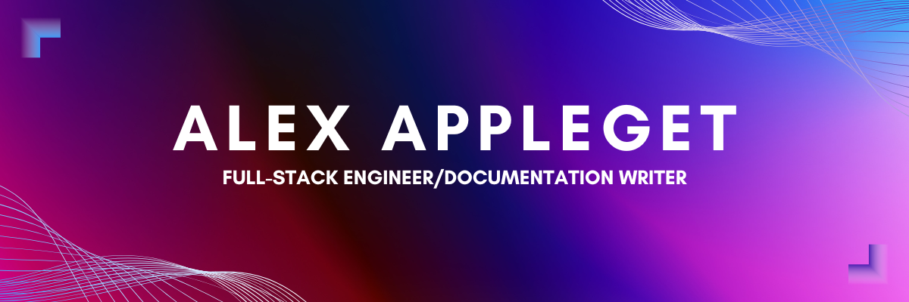

## 👋 Hi, I'm Alex Appleget

🧑‍💻 I'm Full-Stack Software Engineer who loves writing documentation to help other developers learn.

🔒 Lately, I've developed a passion for understanding authentication and how it's built from JWTs to secure cookie management and refresh tokens.

✨ I enjoy Harry Potter and traveling the world.

## 🚀 Latest Project

[Frontend](https://github.com/alexappleget/terrrrr-frontend) | [Backend](https://github.com/alexappleget/terrrrr-backend)

### 📚 Project Overview

This web app lets people sign up, create their own worlds (like guilds), invite friends via a join code, and coordinate group gameplay. It's currently tailored for one game my friends and I play, but I plan to expand it to support more games. I built this because Discord can get overcrowded, making it hard to keep track of game coordination. My app helps by providing:

- Notes for reminders or help requests (ex: "I need help getting more iron ore for my armor.")
- Event creation so world members can join and see who's available.
- Admin settings with role-based access control.

I also rolled my own authentication system using JWTs and refresh tokens with httpOnly cookies.

## 📊 GitHub Stats

## Languages and Tools

